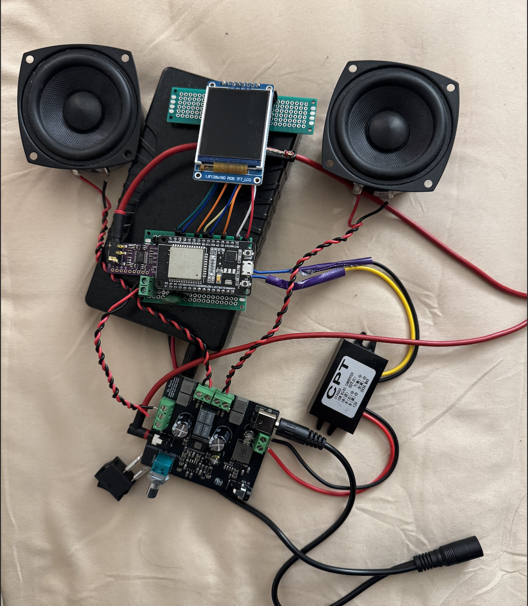

# Bluetooth Speaker Project  

Hello! My name is **Ronak Patel**, and this repository contains my work on building a **Bluetooth speaker with a metadata display**.  

At a high level, the flow from **phone → speaker** involves:  
1. Reception of the Bluetooth audio signal  
2. Conversion to analog audio  
3. Amplification and playback  

While commercial modules worked out of the box, I wanted to explore improvements and unique features:  
- A **portable speaker** with a **metadata display** (song title, artist, album)  
- An **audio visualizer** running on a TFT screen  
- My **first custom amplifier PCB**, designed in *KiCad*, to replace a noisy off-the-shelf board  

This project became an opportunity to learn the **full EE process**: embedded programming (ESP32), PCB design, and iterative prototyping.  

---

## High-Level Design  

### ESP32-WROOM-32 (Bluetooth Classic, A2DP sink)  
- Uses the [pschatzmann A2DP library](https://github.com/pschatzmann/ESP32-A2DP)  
- Supports **Bluetooth Classic**, which is required for A2DP audio  
- Provides metadata callback for song information  

### PCM5102A DAC  
- Converts I²S stream from ESP32 into high-quality analog audio  
- Chosen instead of ESP32’s internal 8-bit DAC (too low quality)  

### 1.8" TFT Display (128×160 px)  
- Upper half: **metadata** (title, artist, album)  
- Lower half: **audio visualizer** via FFT bins  
- Smooth GUI achieved by pushing the display as a **sprite**  

### Power System  
- **3S2P Li-ion battery pack** + **buck converter**  
- Amplifier powered directly from the battery via DC barrel jack  
- ESP32 power tapped via screw terminal  

---

## Amplifier Board (Custom PCB)  

### TPA3116D2 (Class D Audio Amp)  
- High power output, good fidelity  
- Efficient for **battery-powered** audio  

### TPS611781 (Boost Converter)  
- Steps up battery to ~19.6V  
- Stable voltage maximizes amplifier power output  

### NE5532 Op-Amp + RK09712200MY Potentiometer  
- Provides **stereo volume control**  
- Low output impedance prevents input impedance mismatch  

---

## Current Status  

- Speaker is **functional**, with enclosure designed (cutting pending)  
- Issues with the **RK09712200MY pot** (rated for 9V, running at 20V):  
  - Behaves like a balance control instead of volume  
  - Both output channels not stable under all loads  
- Audio visualizer: bass frequencies **dominate FFT output**, needs better equalization  

---

## Future Improvements  
- Integrate **all components** into one PCB  
- Refine **FFT visualization** for better frequency distribution  
- Replace problematic **potentiometer** with a properly rated alternative  
- Improve **enclosure fabrication** for a polished final product  

---

## Pictures

---

